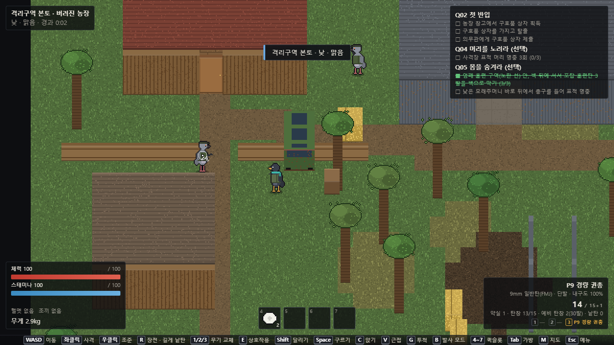
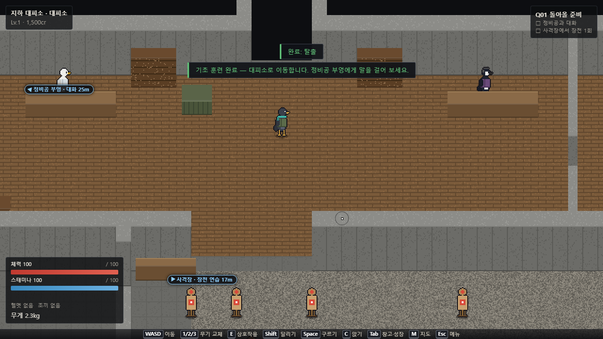
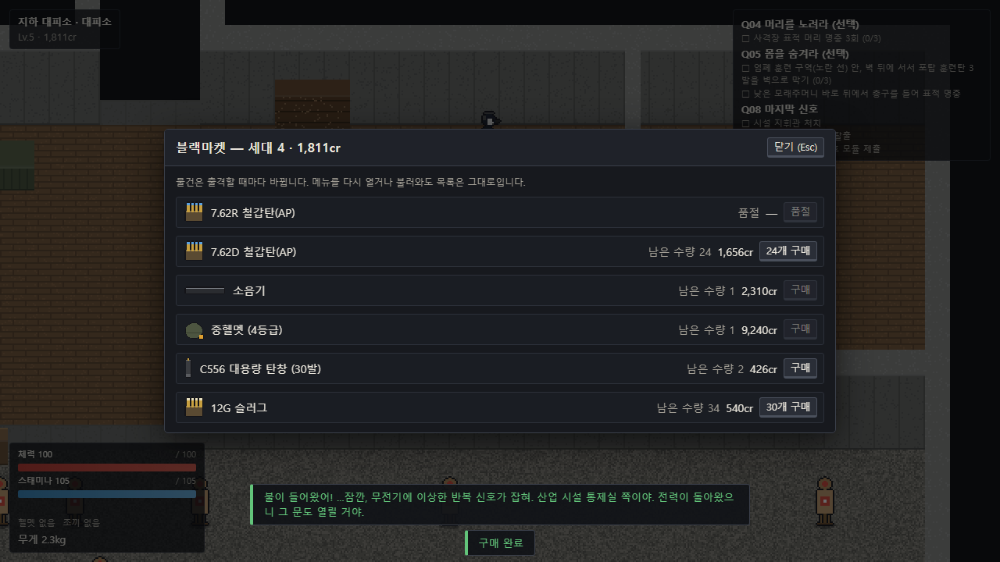
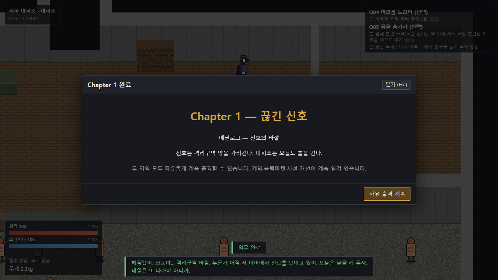

<div align="center">

# 잿빛 귀환: 격리구역

**준비하고, 출격하고, 살아 돌아오세요.**

폐쇄된 격리구역을 탐험해 보급품을 챙기고, 지하 대피소를 다시 세우는 한국어 싱글 플레이 2D 픽셀 슈터입니다.

[▶ 브라우저에서 바로 플레이](https://legerdo.github.io/ashen-return/)


</div>

## 스크린샷

<p align="center">
  
</p>

<p align="center">
  
  
</p>

<p align="center">
  
</p>

## 게임 소개

폐쇄된 격리구역의 지하 대피소에서 장비를 준비하고, 위험 지역에 출격해 필요한 물자를 회수하세요. 총성과 이동 소리는 적을 끌어들이며, 엄폐·탄약·부상·소지 무게·탈출 경로가 귀환 시점을 결정합니다. 전리품을 무사히 가져오면 대피소의 시설과 장비를 발전시켜 더 먼 지역에 도전할 수 있습니다.

### 주요 시스템

- **전술 전투:** 조준, 탄도와 관통, 엄폐, 재장전, 부상과 회피를 고려하는 실시간 전투
- **위험한 출격:** 격리구역 본토와 외곽 보급로에서 탐색·전투·루팅 후 탈출
- **대피소 성장:** 퀘스트, NPC, 특전, 시설 건설, 제작·수리, 상점과 블랙마켓
- **지속되는 진행:** 출격 중 체크포인트와 브라우저 재접속 후 복구되는 세이브
- **독립 실행:** 로그인이나 게임 서버 없이 브라우저와 정적 호스팅만으로 플레이

새 슬롯을 만들면 조작 튜토리얼이 시작됩니다. 튜토리얼을 마치거나 건너뛰면 대피소에서 첫 출격을 준비할 수 있습니다.

## 조작

게임 화면 아래의 키 안내와 **설정 → 조작**에서 현재 키 배치를 확인하거나 변경할 수 있습니다.

| 입력 | 동작 |
| --- | --- |
| `W A S D` / 방향키 | 이동 |
| 마우스 | 조준 방향 |
| 좌클릭 / 우클릭 | 사격 / 조준 |
| `E` | 상호작용 |
| `Shift` / `Space` / `C` | 달리기 / 구르기 / 앉기 |
| `1`–`3` / `R` | 무기 선택 / 재장전 |
| `V` / `G` / `B` | 근접 공격 / 투척 / 발사 모드 변경 |
| `4`–`7` | 퀵슬롯 사용 |
| `Tab` / `M` / `Esc` | 가방·거점 메뉴 / 지도 / 메뉴 |

재장전은 `R`을 눌러 탄창을 교체합니다. 예비 탄창이 없을 때 `R`을 길게 누르면 낱탄을 채웁니다.

## 로컬에서 실행

### 필요 환경

- Node.js **24 이상**과 npm
- 키보드와 마우스가 연결된 최신 브라우저

### Windows 빠른 실행

프로젝트 폴더의 `run.bat`을 더블클릭하세요. Node.js와 npm 버전을 확인하고 필요한 패키지가 없으면 설치한 뒤 개발 서버와 브라우저를 엽니다.

### 직접 실행

```bash
npm install
npm run dev
```

터미널에 표시된 로컬 주소를 브라우저에서 여세요. 정적 빌드와 미리보기는 다음 명령으로 실행할 수 있습니다.

```bash
npm run build
npm run preview
```

`file://`로 `index.html`을 직접 여는 대신 로컬 서버나 HTTP(S) 호스트를 사용하세요. 세이브는 현재 브라우저의 IndexedDB에 저장되며 다른 브라우저나 기기와 자동 동기화되지 않습니다.

## 개발 명령

| 명령 | 설명 |
| --- | --- |
| `npm run dev` | Vite 개발 서버 실행 |
| `npm run typecheck` | TypeScript 타입 검사 |
| `npm run test` | 단위·시뮬레이션 테스트 실행 |
| `npm run test:e2e` | Playwright 브라우저 시나리오 실행 |
| `npm run build` | 배포용 정적 파일을 `dist/`에 생성 |
| `npm run preview` | 빌드 결과 미리보기 |
| `npm run pages:prepare` | 빌드 후 GitHub Pages용 `docs/` 갱신 |

## 기술 구성

- **TypeScript 7** — 게임 규칙, 전투, 인벤토리, 진행 상태
- **Phaser 4** — 2D 월드 렌더링과 카메라
- **Vite 8** — 개발 서버와 정적 빌드
- **IndexedDB** — 로컬 세이브와 체크포인트
- **Vitest / Playwright** — 규칙 검증과 실제 브라우저 흐름

시뮬레이션 상태와 화면 표현을 분리해 게임 규칙이 렌더 프레임 속도에 좌우되지 않도록 구성했습니다.

## 저장소 구조

```text
src/
├─ ai/            적의 시야·청각·전술 행동
├─ combat/        무기, 탄도, 피해, 재장전
├─ content/       아이템·적·지역 데이터
├─ economy/       거래, 제작, 시설, 대피소 건설
├─ game/          앱 상태와 게임 루프
├─ inventory/     아이템 인스턴스와 컨테이너
├─ presentation/  입력, 렌더링, 오디오
├─ progression/   퀘스트, 계약, 특전, 출격 흐름
├─ save/          IndexedDB 저장과 복구
├─ ui/            HUD, 메뉴, 한국어 문구
└─ world/         고정 간격 시뮬레이션과 월드 규칙
tests/             단위·시뮬레이션 테스트
e2e/               Playwright 브라우저 시나리오
Prompt/             게임의 전체 제품 명세
scripts/            정적 서버와 Pages 빌드 스크립트
docs/               GitHub Pages 파일과 README 스크린샷
```

## GitHub Pages 배포

이 저장소는 `main` 브랜치의 `/docs` 폴더를 GitHub Pages 게시 경로로 사용합니다. 소스 코드를 수정한 뒤 다음 명령으로 게임을 다시 빌드하고 게시 파일을 갱신하세요.

```bash
npm run pages:prepare
git add docs
git commit -m "chore: update Pages build"
git push origin main
```

`pages:prepare`는 스크린샷을 보존하면서 `dist/`의 앱 파일만 `docs/`에 반영합니다. `main`의 변경 사항을 푸시하면 GitHub Pages가 사이트를 다시 게시합니다.
